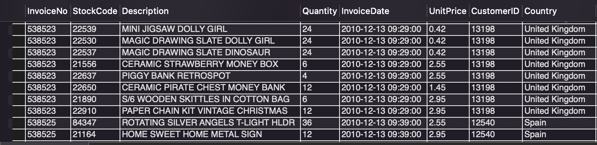
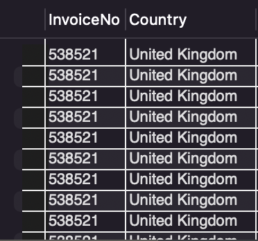
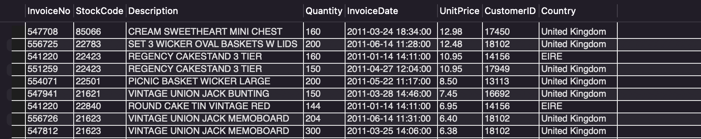
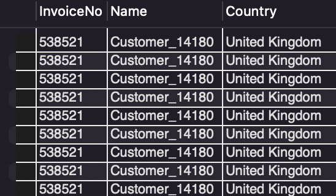
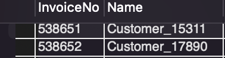
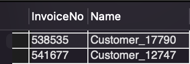
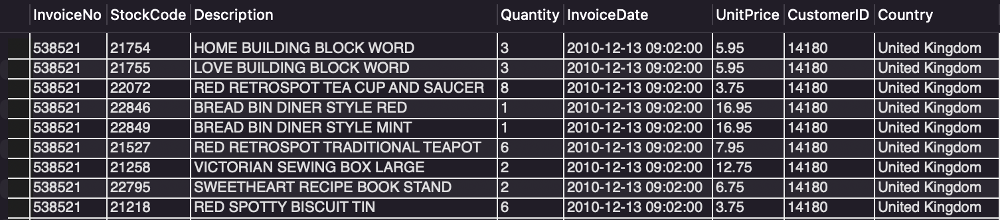
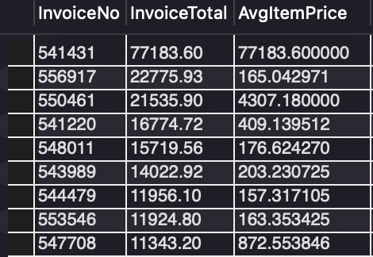
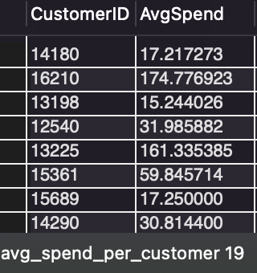
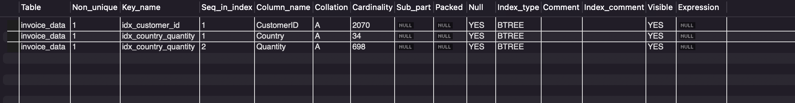

# Invoice Data SQL Query Outputs

This project showcases SQL queries performed on the `invoice_data` table. The queries include data retrieval, filtering, aggregation, joins, subqueries, views, and indexing. Screenshots are attached for each query's output.

---

## 📌 Basic Data Query

**Description:** Retrieves the first 200 rows from the invoice data to get an overview of the dataset.

---

## 📌 Using SELECT, WHERE, ORDER BY, GROUP BY

### ▶️ Filter by Country
**Description:** Fetches InvoiceNo and Country for records where the country is United Kingdom.

### ▶️ Quantity Filter with Ordering
**Description:** Retrieves invoices where quantity is greater than 100 and sorts by UnitPrice in descending order.

### ▶️ Group By Country with Count
**Description:** Groups orders by country and shows the number of total orders per country in descending order.

---

## 📌 Creating New Table: Customers

**Description:** Creates a new table of customers with distinct CustomerIDs and a custom name format (e.g., `Customer_12345`).

---

## 📌 Using JOINS

### ▶️ INNER JOIN
**Description:** Displays invoice details with customer names where matching CustomerIDs exist.

### ▶️ LEFT JOIN
**Description:** Retrieves all invoices and adds customer names if available.

### ▶️ RIGHT JOIN
**Description:** Retrieves all customers and adds invoice details if available.

---

## 📌 Subqueries

### ▶️ Customers from UK
**Description:** Retrieves all invoice records where the customer is from UK using a subquery.

### ▶️ Latest Invoice Date
**Description:** Finds invoice records from the latest available date.

---

## 📌 Aggregate Functions

### ▶️ Total Revenue
**Description:** Calculates the total sales revenue by multiplying quantity with unit price.

### ▶️ Average Order Value
**Description:** Calculates the total and average order value for each invoice.

---

## 📌 Using Views

### ▶️ Revenue by Country
**Description:** A view showing the total revenue grouped by country.

### ▶️ Average Spend per Customer
**Description:** A view showing the average amount spent by each customer.

### ▶️ Top 5 Invoices
**Description:** A view listing the top 5 invoices with the highest total amount.

---

## 📌 Query for Indexing

**Description:** A simple query to fetch the first row, used to trigger indexing or performance checks.

---

## ✅ Conclusion

This README documents and visualizes various SQL operations on an invoice dataset using MySQL. The images illustrate the output of each query, helping readers understand the effects of SQL clauses and operations in practical scenarios.

